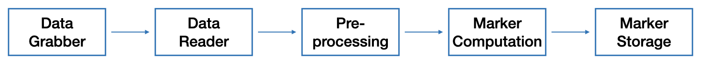
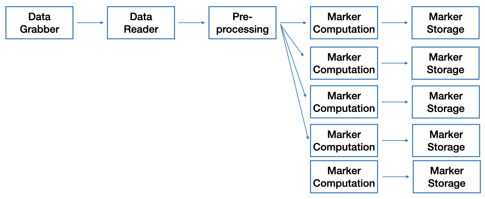

.. include:: ../links.inc

.. _pipeline:

The Junifer Pipeline
====================

The junifer pipeline is the main execution path of junifer. It consists of five steps:

1. :ref:`Data Grabber <datagrabber>`: Interpret the dataset and provide a list of files.
2. :ref:`Data Reader <datareader>`: Read the files.
3. :ref:`Pre-processing <preprocess>`: Prepare the images for marker computation.
4. :ref:`Marker Computation <marker>`: Compute the marker.
5. :ref:`Storage <storage>`: Store the marker values.

The element that is passed accross the pipeline is called the :ref:`Data Object<data_object>`.

The following is a graphical representation of the pipeline:

However, it is usually the case that several markers are computed for the same data. Thus, the *markers* step 
of the pipeline is defined as a list of markers. The following is a graphical representation of the pipeline execution
on multiple markers:

.. note:: To avoid keeping in memory all of the computed marker, the storage step is called after each marker
    computation, releasing the memory used to compute each marker.